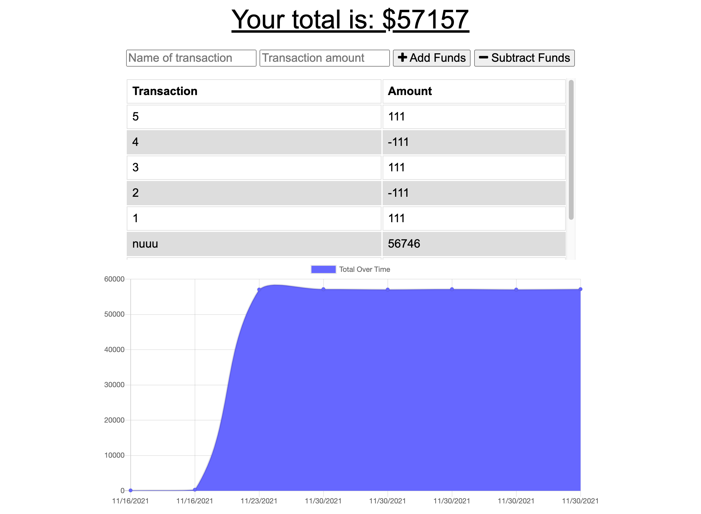

# Budget-Tracker

#  Budget Tracker

This application was deployed through heroku [click here](https://budget-tracker-off-online.herokuapp.com/) to open the app!!

##  Add transactions online or offline with this budget tracker. 
### Table of contents
- [Installation](#installation)
- [Usage](#usage)
- [Contributors](#contributors)
- [License](#license)
### Installation
`npm i` to install all packages
### Usage
Add or subtract transactions. When you are offline your transactions will be cache. Once back online it will transfer over. 

## License
This repository is covered by the MIT License    
https://opensource.org/licenses/MIT
#### Contributors
Ethan Cho, Chuck Stephens
#### Test Instructions
none
##### Questions
If you have any questions please feel free to contact me through GitHub: [CortezStephanie](https://github.com/CortezStephanie)
